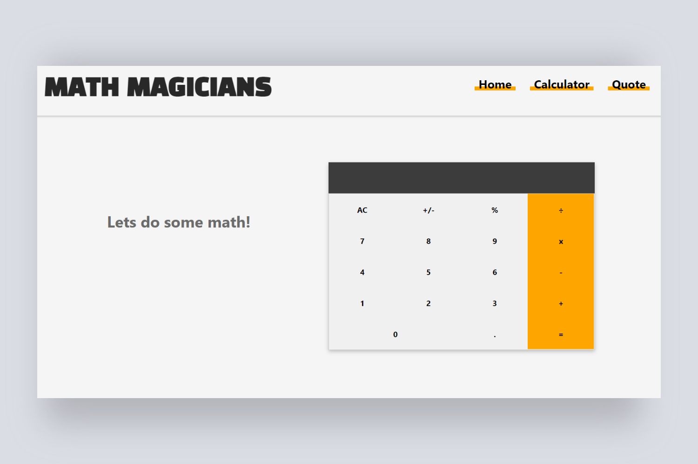

# Math Magicians

> A single-page React app that allows the user to make simple calculations.

## Preview

## Live Demo

Check out the live demo [here](https://mathmagicians-shyusu4.netlify.app/)

## Built with

- React
- JSX

## Getting Started

- Clone the repo `git@github.com:shyusu4/Math-Magicians.git`
- cd `into` the project
- Run `git pull origin app`
- Run `yarn install` or `npm install` to install dependencies
- On the terminal run `npm run start` open up the live server
- To run tests run `npm run test` on the terminal

## Authors

**Shakhrizoda Yusupova**

- GitHub: [@shyusu4](https://github.com/shyusu4)
- Twitter: [@shyusu4](https://twitter.com/shyusu4)
- LinkedIn: [Shakhrizoda Yusupova](https://www.linkedin.com/in/shyusu4/)

## Contributing

Contributions, issues, and feature requests are welcome!

Feel free to check the [issues page.](https://github.com/shyusu4/Math-Magicians/issues)

## Show your support

Give a ⭐️ if you like this project!

## Acknowledgments

Microverse

## License

This project is [MIT](https://github.com/shyusu4/Math-Magicians/blob/main/MIT.md) licensed.
